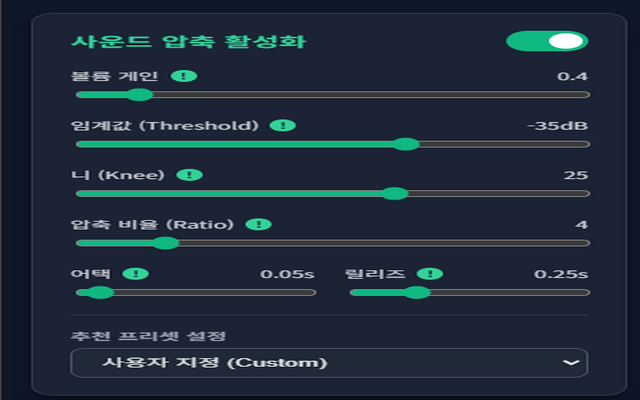

# 🎧 사운드 압축기 (Dynamic Audio Compressor)

웹 브라우저에서 재생되는 영상 및 오디오의 볼륨을 실시간으로 평준화하여, 일정한 음량의 편안한 청취 환경을 제공하는 크롬 확장 프로그램입니다. 

작은 목소리는 선명하게 키워주고, 갑작스러운 비명이나 총소리(갑툭튀)는 즉시 억눌러 귀를 보호합니다.

### 🛒 크롬 웹스토어에서 다운로드
👉 **[사운드 압축기 (Dynamic Compressor) 설치하기](https://chromewebstore.google.com/detail/%EC%82%AC%EC%9A%B4%EB%93%9C-%EC%95%95%EC%B6%95%EA%B8%B0-dynamic-compresso/epjmepgbmkdenikjlkmiabhidlkiakjf?authuser=0&hl=ko)**

---

## ✨ 주요 기능 (Features)

* **실시간 오디오 컴프레션:** Web Audio API의 `DynamicsCompressorNode`를 활용하여 지연 없는 오디오 다이내믹 레인지 제어.
* **사이트별 독립 프리셋 유지:** 유튜브, 트위치 등 접속한 도메인별로 각기 다른 설정값과 상태(ON/OFF)를 개별적으로 로컬 스토리지에 저장하고 자동 적용합니다.
* **상황 맞춤형 추천 프리셋:** 
  * `일반 방송/유튜브 시청`: 대화와 배경음의 밸런스를 맞추는 부드러운 설정
  * `깜놀 방지용 (하드 리미터)`: 공포 게임 등에서 발생하는 피크(Peak) 소음을 0초 만에 완벽 차단
* **전문가용 파라미터 제어:** Gain, Threshold, Ratio, Knee, Attack, Release 등 6가지 핵심 오디오 파라미터를 실시간으로 조절 가능.
* **모던 UI/UX:** 다크 모드와 글래스모피즘(Glassmorphism) 기반의 직관적이고 세련된 인터페이스 제공.

## 🚀 설치 방법 (Installation)

### 방법 1. 크롬 웹스토어 설치 (권장)
가장 쉽고 안전한 방법입니다. 업데이트가 자동으로 지원됩니다.
1. [크롬 웹스토어 페이지](https://chromewebstore.google.com/detail/%EC%82%AC%EC%9A%B4%EB%93%9C-%EC%95%95%EC%B6%95%EA%B8%B0-dynamic-compresso/epjmepgbmkdenikjlkmiabhidlkiakjf?authuser=0&hl=ko)에 접속합니다.
2. **[Chrome에 추가]** 버튼을 눌러 설치합니다.

### 방법 2. 수동 설치 (개발자용)
코드를 직접 수정하거나 기여하고 싶으신 경우 아래 방법을 사용하세요.
1. 이 저장소를 클론하거나 `[Code] -> [Download ZIP]`을 눌러 압축을 풉니다.
2. 크롬 브라우저 주소창에 `chrome://extensions/`를 입력하여 확장 프로그램 관리 페이지로 이동합니다.
3. 우측 상단의 **'개발자 모드'**를 활성화합니다.
4. 좌측 상단의 **'압축해제된 확장 프로그램을 로드합니다'** 버튼을 클릭하고, 다운로드한 폴더를 선택합니다.

## 💡 사용 방법 (Usage)

1. 볼륨 조절이 필요한 웹사이트(예: YouTube)에 접속하여 영상을 재생합니다.
2. 우측 상단의 확장 프로그램 아이콘(🎧)을 클릭하여 팝업을 엽니다.
3. 현재 사이트가 미등록 상태라면 `[+ 이 사이트도 추가하기]` 버튼을 눌러 권한을 허용합니다. (새로고침 필요)
4. '사운드 압축 활성화' 스위치를 켜고 원하는 프리셋을 선택하거나 슬라이더를 수동으로 조절합니다.

## 🛠 기술 스택 (Tech Stack)

* **Frontend:** HTML5, CSS3 (Glassmorphism design), Vanilla JavaScript
* **API:** Chrome Extension API (Manifest V3), Web Audio API

## 🔒 개인정보 및 보안 (Privacy & Security)

본 확장 프로그램은 철저히 사용자의 브라우저(Local) 환경에서만 작동합니다. 
영상 및 오디오 데이터를 비롯한 어떠한 사용자 개인정보도 수집, 저장, 또는 외부 서버로 전송하지 않습니다. 최소한의 권한(`activeTab`, `storage`, `scripting`)만을 요청하여 안전하게 동작합니다.

## 📝 라이선스 (License)

이 프로젝트는 [MIT License](LICENSE)를 따릅니다.
